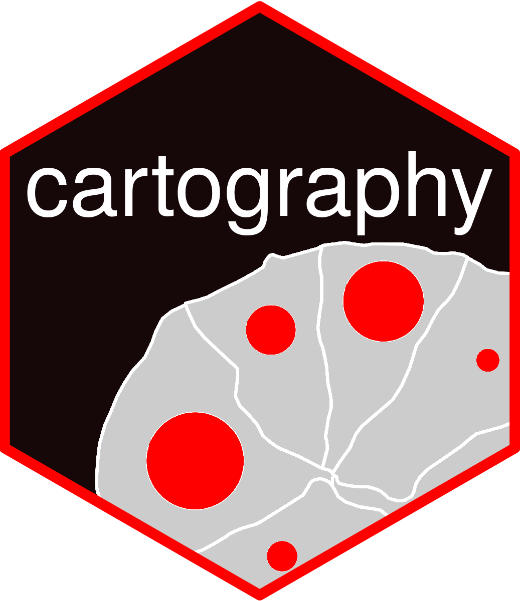

# cartography 

[](https://cran.r-project.org/package=cartography)
[](https://cran.r-project.org/package=cartography)
[](https://github.com/riatelab/cartography/actions)
[](https://codecov.io/gh/riatelab/cartography)
[](https://tinyverse.netlify.app/)
[](https://doi.org/10.21105/joss.00054)
[](https://cran.r-project.org/)


## Create and integrate maps in your R workflow! 
This package helps to design **cartographic representations** such as proportional symbols, choropleth, typology, flows or discontinuities maps. It also offers several features that improve the graphic presentation of maps, for instance, map palettes, layout elements (scale, north arrow, title...), labels or legends.

## Cheat Sheet
The [cheat sheet](http://riatelab.github.io/cartography/vignettes/cheatsheet/cartography_cheatsheet.pdf) displays a quick overview of `cartography`'s main features.

<a href="http://riatelab.github.io/cartography/vignettes/cheatsheet/cartography_cheatsheet.pdf"></a>


## Roadmap
The version 3.0.0 of cartography introduce a lot of novelties.
In this version, old ways are only deprecated. 
Switch of the deprecation warnings with `options(lifecycle_verbosity = "quiet")` or `cartography_legacy_mode("on")`

**Don't Panic !**
The old functions (and their warnings) will stay in cartography for a period 
long enougth to allow you to switch to the new API. 

Your old code base build upon cartography can survive the change. 
Nonetheless, changing to new function is more than recommended. Use warnings indications to do so. 

After a long enought period, thes function will be noted as defunct (present in the package but not functionning). 

It's likely that some function will not survive the switch to the new API (looking at you propSymbolsTriangleLayer and smoothLayer, getTiles and tilesLayer). 

All examples, demo, vignette switch to the new API. 
After an even larger period defunct function will be removed from the package. 


All new functions starts with 'tc_'. tc_ stands for Thematic Cartography. 

Core functions start with tc_map


Why not a new package ? 
Despite all the novelties, the set of function remane the same, the way of thinking also (painter model ?), only additions. 


ROADMAP

* 2015 - V1.0.0 creation of the package
* 2018 - v2.0.0 introduce sf 
* 2021 - v3.0.0 clean deprecated/defunct function, introduce cleaner API focus on sf objects, updated documentation. 
* 2022 - v3.x.x remove old function, defunct old  function)


## Vignette
The [vignette](https://CRAN.R-project.org/package=cartography/vignettes/cartography.html) 
contains commented scripts on how to build various types of maps with `cartography`:  

[](https://CRAN.R-project.org/package=cartography/vignettes/cartography.html)

## Other Resources 

* [Giraud T. (2019). Thematic Maps with `cartography`. useR! 2019. Toulouse, France.](https://github.com/rCarto/user2019) (EN)  
* [Giraud T., Lambert N. (2017). Reproducible Cartography. In: Peterson M. (eds) Advances in Cartography and GIScience. ICACI 2017. Lecture Notes in Geoinformation and Cartography. Springer, Cham](https://github.com/riatelab/ReproducibleCartography) (EN)      
* [Blog posts](https://rgeomatic.hypotheses.org/category/cartography) (FR / EN)  


## Demo
The following script creates a map of symbols that are proportional to values of a 
first variable and colored to reflect the classification of a second variable.  

```{r, eval = FALSE}
library(cartography)
# import the demo sf object
mtq <- tc_import_mtq()
# Plot municipalities
tc_map(mtq)
# Add symbols with choropleth coloration (population & median income)
propSymbolsChoroLayer(x = mtq, var = "POP", var2 = "MED")
# Add title and credits
tc_title("Population & Wealth in Martinique, 2015") 
tc_credits("Sources: Insee and IGN - 2018")
```


```{r, eval = FALSE}
########## Final Map
# Set figure margins
opar <- par(mar = c(0,0,1.2,0))
# Plot the municipalities
tc_map(mtq, col="darkseagreen3", border="darkseagreen4",  
     bg = "lightblue1", lwd = 0.5)
# Plot symbols with choropleth coloration
propSymbolsChoroLayer(x = mtq, var = "POP", inches = 0.4, border = "grey50",
                      lwd = 1, legend.var.pos = "topright", 
                      legend.var.title.txt = "Population",
                      var2 = "MED", method = "equal", nclass = 4, 
                      col = carto.pal(pal1 = "sand.pal", n1 = 4),
                      legend.var2.values.rnd = -2,  legend.var2.pos = "left", 
                      legend.var2.title.txt = "Median Income\n(in euros)") 
# Plot a layout
layoutLayer(title="Population & Wealth in Martinique, 2015", 
            author = "cartography 2.1.3", 
            sources = "Sources: Insee and IGN - 2018", 
            scale = 5, tabtitle = TRUE, frame = FALSE)
# Plot a north arrow
north(pos = "topleft")
# restore graphics parameters
par(opar)
```


## Installation

* Development version on GitHub
```{r, eval = FALSE}
require(remotes)
install_github("riatelab/cartography")
```

* Stable version on [CRAN](https://CRAN.R-project.org/package=cartography/)
```{r, eval = FALSE}
install.packages("cartography")
```


## Alternatives Packages
* [tmap](https://github.com/mtennekes/tmap)    
* [ggplot2](https://github.com/tidyverse/ggplot2) + [ggspatial](https://github.com/paleolimbot/ggspatial)     
* [oceanis](https://github.com/insee-psar-at/oceanis-package)  


## Community Guidelines

One can contribute to the package through [pull requests](https://github.com/riatelab/cartography/pulls) and report issues or ask questions [here](https://github.com/riatelab/cartography/issues).


