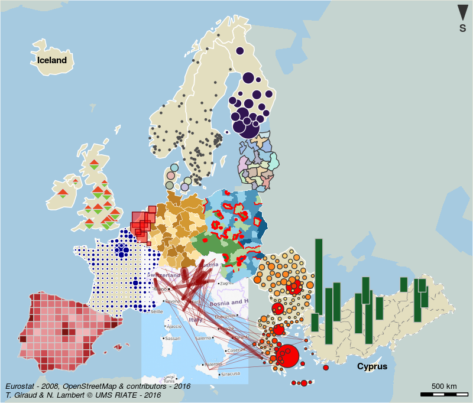

# Summary

`cartography` is an R package (@R) for thematic mapping. It allows various cartographic representations such as proportional symbols, chroropleth, typology, flows or discontinuities. In addition it also proposes some useful features like cartographic palettes, layout (scale, north arrow, title…), labels, legends or access to cartographic API to ease the graphic presentation of maps.

The package relies mostly on `sp` (@sp2005,  @sp2013) and `rgeos` (@rgeos) packages to handle and transform spatial data. 

The map below is a cartographic composition showing most of the representations enabled by the package. 

# References
