```{r, include = FALSE}
knitr::opts_chunk$set(
  collapse = TRUE,
  comment = "#>", 
  fig.path="./fig/", 
  fig.width = 4.08, 
  fig.height = 5
)
```

# Introduction

The aim of `cartography` is to obtain thematic maps with the visual quality of those build with a classical mapping or GIS software.

Users of the package could belong to one of two categories: cartographers willing to use R or R users willing to create maps. Therefore, its functions have to be intuitive to cartographers and ensure compatibility with common R workflows.

`cartography` uses [`sf`](https://CRAN.R-project.org/package=sf) objects to produce `base` graphics.  

`cartography` functions can be classified in the following categories :

- **Symbology**\
Each function focuses on a single cartographic representation (e.g. proportional symbols or choropleth representation) and displays it on a georeferenced plot. This solution allows to consider each representation as a layer and to overlay multiple representations on a same map. Functions names start with `tc_map_` and each function has two main arguments that are:
  - `x`, an `sf` object),
  - `var`, the name(s) of a variable(s) to map.  
  
  Many parameters are available to fine tune the cartographic representations. These parameters are the common ones found in GIS and automatic cartography tools (e.g. classification and color palettes used in choropleth maps, symbols sizes used in proportional symbols maps...).

- **Transformations**\
A set of functions is dedicated to the creation or transformation of spatial objects (e.g. borders extraction, grid or links creation). These functions are provided to ease the creation of some more advanced maps that usually need geo-processing. Functions name start with `tc_get_`.

- **Map Layout**\
Along with the cartographic functions, some other functions are dedicated to layout design (e.g. customizable scale bar, north arrow, title, sources or author information...).

- **Legends**\
Legends are displayed by default along cartographic layers but more parameters are available through `tc_leg_*()` functions.

# Main Features

## Symbology

+------------------------------+---------------+------------------+----------------------+-----------------------+---------------------+---------------------------+
| map type                     | name          | data type        | polygon              | point                 | line                | deprecated                |
+==============================+===============+==================+======================+=======================+=====================+===========================+
| Base Map                     | `tc_map()`    | geometry         | 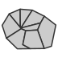    |     | 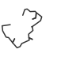   | \-                        |
+------------------------------+---------------+------------------+----------------------+-----------------------+---------------------+---------------------------+
| Proportional Symbols         | `tc_map_p()`  | stock            |   |   | 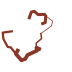 | `propSymbolsLayer()`      |
+------------------------------+---------------+------------------+----------------------+-----------------------+---------------------+---------------------------+
| Typology                     | `tc_map_t()`  | category         | 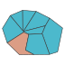  |   | 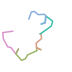 | `typoLayer()`             |
+------------------------------+---------------+------------------+----------------------+-----------------------+---------------------+---------------------------+
| Choropleth                   | `tc_map_c()`  | ratio            |   |   | 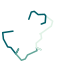 | `choroLayer()`            |
+------------------------------+---------------+------------------+----------------------+-----------------------+---------------------+---------------------------+
| Symbols                      | `tc_map_s()`  | category         |   |   |                     | \-                        |
+------------------------------+---------------+------------------+----------------------+-----------------------+---------------------+---------------------------+
| Graduated Symbols            | `tc_map_g()`  | stock            |   |   | 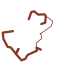 | \-                        |
+------------------------------+---------------+------------------+----------------------+-----------------------+---------------------+---------------------------+
| Proportional Symbols + Typo  | `tc_map_pt()` | stock & category |  |  |                     | `propSymbolsTypoLayer()`  |
+------------------------------+---------------+------------------+----------------------+-----------------------+---------------------+---------------------------+
| Proportional Symbols + Choro | `tc_map_pc()` | stock & ratio    |  |  |                     | `propSymbolsChoroLayer()` |
+------------------------------+---------------+------------------+----------------------+-----------------------+---------------------+---------------------------+
| Symbols + Choro              | `tc_map_sc()` | category & ratio | 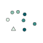 |  |                     | \-                        |
+------------------------------+---------------+------------------+----------------------+-----------------------+---------------------+---------------------------+
| Dot density                  | `tc_map_dd()` | stock            | 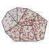 |                       |                     | `dotDensityLayer()`       |
+------------------------------+---------------+------------------+----------------------+-----------------------+---------------------+---------------------------+
| Discontinuities              | `tc_map_d()`  | stock \| ratio   |   |                       |                     | `discLayer()`             |
+------------------------------+---------------+------------------+----------------------+-----------------------+---------------------+---------------------------+

## Map Layout

|                                |
|:------------------------------:|
| 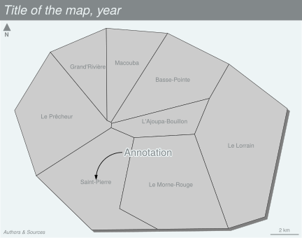{width="4in"} |

+-----------------+----------------------+
| name            | deprecated           |
+=================+======================+
| `tc_title()`    | \- / `layoutLayer()` |
+-----------------+----------------------+
| `tc_arrow()`    | `north()`            |
+-----------------+----------------------+
| `tc_credits()`  | \- / `layoutLayer()` |
+-----------------+----------------------+
| `tc_scale()`    | `barscale()`         |
+-----------------+----------------------+
| `tc_layout()`   | `layoutLayer()`      |
+-----------------+----------------------+
| `tc_annotation` | \-                   |
+-----------------+----------------------+
| `tc_label()`    | `labelLayer()`       |
+-----------------+----------------------+


## Themes

`tc_theme()` defines a map theme. It sets the margins of the figure, a background color, a foreground color and some parameters of the title. A set of theme is included in the package and it is possible to create cutom ones.

|                                      |                                         |                                      |
|:------------------------------------:|:---------------------------------------:|:------------------------------------:|
| 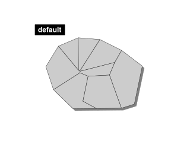{width="2in"} | 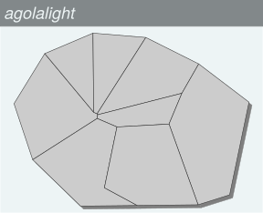{width="2in"} | {width="2in"}  |
|  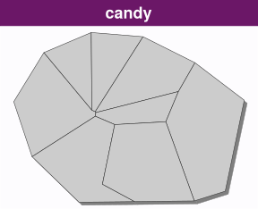{width="192"}  |    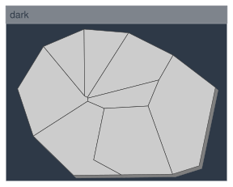{width="192"}    | 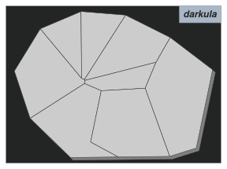{width="192"} |
|  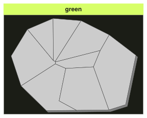{width="192"}  |  {width="192"}   |   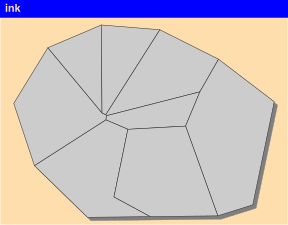{width="192"}   |
|   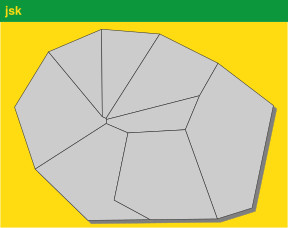{width="192"}   | 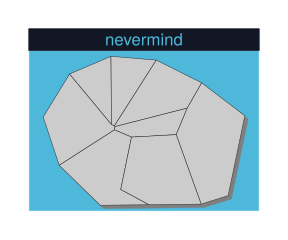{width="192"}  |                                      |

## Export

The `tc_init()` function can be used to export maps in raster (.png) or vector formats (.svg). 
The size of the exported map will fit the height/width ratio of a spatial object. 

## Datasets

Several datasets are embedded in the package:

- A [GeoPackage](https://www.geopackage.org/) of Martinique municipalities can be imported with `tc_import_mtq()` (or via `sf::st_read()`).

  - Sources: [Base comparateur de territoires](https://www.insee.fr/fr/statistiques/2521169) (upload date: 2018-09-25) & [ADMIN EXPRESS-COG](http://professionnels.ign.fr/adminexpress) (2018 edition).
  - Citation: Insee and IGN, 2018
  
  - Fields:
  
    - **INSEE_COM**: Municipality identifier
    - **STATUS**: Municipality administrative status
    - **LIBGEO**: Municipality name
    - **POP**: Total population, 2015
    - **MED**: Median disposable income adjusted per equivalent household member, in euros, 2015
    - **CHOM**: Unemployed population, 2015
    - **ACT**: Active population, 2015

- A csv file of professional mobility flows between Martinique municipalities.

  - Sources: [Flux de mobilité - déplacements domicile-lieu de travail](https://www.insee.fr/fr/statistiques/3566477) (upload date: 2018-08-01)
  
  - Citation: Insee, 2018
  
  - Fields:
  
    - **i**: Municipality of residence identifier
    - **j**: Municipality of workplace identifier
    - **fij**: Flows of workers (employed population, 15 y.o. or more, 2015, only flows \> 100)
    - **sj**: Administrative status of the workplace municipality


# Examples of thematic maps

## Base map
`tc_init()` is designed to initiate a map centered on a specific extent (`x` bbox). 
The `theme` argument allow to select a theme and the `shadow` argument add a shadow.   

`tc_map()` displays `sf` objects geometries.   

`tc_layout()` add a complete layout to the map (title, credits, north arrow, scale bar). 
Each layout elements can also be set separetly (with `tc_title()`, `tc_credits()`, `tc_arrow()` and `tc_scale()`).


```{r tc_init, message=FALSE, warning=FALSE}
library(cartography)
# import the sample data set
mtq <- tc_import_mtq()
# Initiate a base map
tc_init(x = mtq, shadow = TRUE, theme = "iceberg")
# plot municipalities 
tc_map(mtq, add = TRUE)
# layout
tc_layout(title = "Martinique", 
          credits = paste0("Sources: IGN, 2018\n",
                           "cartography ", 
                           packageVersion("cartography")))
```

## Proportional Symbols


`tc_map_p()` displays symbols with areas proportional to a quantitative variable (stocks). Several symbols are available (circles, squares, bars). The `inches` argument is used to customize the symbols sizes. 

```{r tc_map_p, message=FALSE, warning=FALSE}
library(cartography)
# import the sample data set
mtq <- tc_import_mtq()
# Initiate a base map
tc_init(x = mtq, shadow = TRUE, theme = "iceberg")
# plot municipalities 
tc_map(mtq, add = TRUE)
# plot population
tc_map_p(
  x = mtq, 
  var = "POP", 
  inches = 0.25, 
  col = "brown4",
  leg_pos = "bottomleft2",  
  leg_title = "Total population"
)
# layout
tc_layout(title = "Population Distribution in Martinique", 
          credits = paste0("Sources: Insee and IGN, 2018\n",
                           "cartography ", 
                           packageVersion("cartography")))
```


## Choropleth Map

In choropleth maps, areas are shaded according to the variation of a quantitative variable. They are used to represent ratios or indices.   
`tc_map_c()` displays choropleth maps . Arguments `nbreaks`, and `breaks` allow to customize the variable classification. `tc_get_breaks()` allows to classify outside of the function itself. Colors palettes, defined with `pal`, can be created with `tc_get_pal()` or you can use palette names from `hcl.pals()`.   

Use `tc_theme()` to set a theme without plotting anything. 


```{r tc_map_c}
library(cartography)
# import the sample data set
mtq <- tc_import_mtq()
# population density (inhab./km2) using sf::st_area()
mtq$POPDENS <- 1e6 * mtq$POP / st_area(mtq)
# set a theme
tc_theme("green")
# plot population density
tc_map_c(
  x = mtq, 
  var = "POPDENS",
  breaks = "geom",
  nbreaks=5,
  col = "Mint",
  border = "white", 
  lwd = 0.5,
  leg_pos = "topright", 
  leg_title = "Population Density\n(people per km2)"
) 
# layout
tc_layout(title = "Population Distribution in Martinique", 
          credits = paste0("Sources: Insee and IGN, 2018\n",
                           "cartography ", 
                           packageVersion("cartography")))
```


## Colored Pencil and Typologies Map

`tc_get_pencil()` transforms POLYGONS or MULTIPOLYGONS in MULTILINESTRINGS. This function creates a layer that mimicks a pencil hand-drawing.  

`tc_map_t()` displays a typology map of a qualitative variable. `val_order` is used to set the modalities order in the legend.   

`tc_label()` displays labels on the map.  


```{r tc_map_t}
library(cartography)
# import the sample data set
mtq <- tc_import_mtq()
# transform municipality multipolygons to (multi)linestrings
mtq_pencil <- tc_get_pencil(x = mtq, size = 400, lefthanded = FALSE)
# set theme
tc_theme("dark")
# plot municipalities (only the backgroung color is plotted)
tc_map(mtq, col = "white", border = NA)
# plot administrative status
tc_map_t(
  x = mtq_pencil, 
  var = "STATUS",  
  pal = c("aquamarine4", "yellow3","wheat"), 
  lwd = .5,
  val_order = c("Prefecture",
                "Sub-prefecture", 
                "Simple municipality"),
  leg_pos = "topright",
  leg_title = "", 
  add = T
)
#  plot municipalities
tc_map(mtq, lwd = 0.5, border = "grey20", col = NA, add = TRUE, lty = 3)
# labels for a few  municipalities
tc_label(x = mtq[mtq$STATUS != "Simple municipality",], var = "LIBGEO", 
         cex = 0.9, halo = TRUE, r = 0.15)
# layout
tc_layout(title = "Administrative Status", 
          credits = paste0("Sources: Insee and IGN, 2018\n",
                           "cartography ", 
                           packageVersion("cartography")))
```


## Proportional Symbols using Choropleth Coloration

`tc_map_pc()` creates a map of symbols that are proportional to values of a first variable and colored to reflect the classification of a second variable. 
A combination of `tc_map_p()` and `tc_map_c()` arguments is used. 

`expandBB` argument in `tc_init()` allows to expand the map space. Here, we increase the space available on the right of the map to avoid overlaps between the legends and the map. 

```{r tc_map_pc, fig.width=5}
library(cartography)
# import the sample data set
mtq <- tc_import_mtq()
# set theme
tc_init(x = mtq, shadow = T, theme = "candy", expandBB = c(0,0,0,.15))
# Plot the municipalities
tc_map(mtq, add = TRUE)
# Plot symbols with choropleth coloration
tc_map_pc(
  x = mtq, 
  var = c("POP", "MED"), 
  border = "grey50",
  lwd = 1,
  leg_pos = c("topright", "right"), 
  leg_title= c("Population","Median\nIncome\n(in euros)"),
  breaks = "equal", 
  nbreaks = 4, 
  pal = "Greens",
  leg_val_rnd = c(0, -2), 
  leg_frame = c(TRUE, TRUE)
) 
# layout
tc_layout(title = "Population & Wealth in Martinique, 2015", 
          credits = paste0("Sources: Insee and IGN, 2018\n",
                           "cartography ", 
                           packageVersion("cartography")), 
          frame = TRUE)

```


## Proportional Symbols using Typology Coloration

`tc_map_pt` creates a map of symbols that are proportional to values of a first variable and colored to reflect the modalities of a second qualitatice variable. A combination of `propSymbolsLayer()` and `typoLayer()` arguments is used. 

```{r tc_map_pt, fig.width=5}
library(cartography)
# import the sample data set
mtq <- tc_import_mtq()
# set theme
tc_init(x = mtq, shadow = T, theme = "ink", expandBB = c(0,0,0,.15))
# Plot the municipalities
tc_map(mtq, add = TRUE)
# Plot symbols with choropleth coloration
tc_map_pt(
  x = mtq, 
  var = c("POP","STATUS"), 
  symbol = "square",
  border = "white",
  lwd = .5,
  leg_pos = c("right",  "topright"), 
  leg_title = c("Population", "Administrative\nStatus"),
  val_order = c("Prefecture", "Sub-prefecture", 
                "Simple municipality")) 
# layout
tc_layout(title = "Population Distribution in Martinique", 
          credits = paste0("Sources: Insee and IGN, 2018\n",
                           "cartography ", 
                           packageVersion("cartography")))
```


## Label Map

`tc_label()` is dedicated to the display of labels on a map. The `overlap = FALSE` argument displays non overlapping labels. 

In this example we have built a custom theme with `tc_theme()`. 

```{r tc_label}
library(cartography)
# import the sample data set
mtq <- tc_import_mtq()
# set theme
my_theme <- list(
  name = "mytheme", 
  bg = "lightblue1", 
  fg = "darkseagreen4", 
  mar = c(0, 0, 0, 0), 
  tab = TRUE, 
  pos = "left", 
  inner = TRUE, 
  line = 1, 
  cex = .9, 
  font = 3)
tc_theme(my_theme)
# plot municipalities
tc_map(mtq, col = "#e4e9de", border = "darkseagreen4")
# plot labels
tc_label(
  x = mtq, 
  var = "LIBGEO", 
  col = "black", 
  cex = 0.7, 
  font = 4,
  halo = TRUE, 
  bg = "white", 
  r = 0.1, 
  overlap = FALSE, 
  lines = FALSE
)
# layout
tc_layout(title = "Municipalities of Martinique", 
          credits = paste0("Sources: Insee and IGN, 2018\n",
                           "cartography ", 
                           packageVersion("cartography")), 
          arrow = FALSE)
# north arrow
tc_arrow(pos ='topright')
```

## Links Map

`tc_get_links()` creates a link layer from an `sf` object and a link `data.frame` (long format).  

`tc_map_g()` displays graduated links. 

We have used `leg_pos = "bottomleft2"` to display the legend in the bottom left corner of the map with an extra space to avoid overlaps between the legend and the credits. 

```{r tc_map_g}
library(cartography)
# import the sample data set
mtq <- tc_import_mtq()
# import the csv file embedded in cartography
mob <- read.csv(system.file("csv/mob.csv", package="cartography"))
# Select links from Fort-de-France (97209))
mob_97209 <- mob[mob$i == 97209, ]
# create an sf object of links
mob_links <- tc_get_links(x = mtq, df = mob_97209)
# set figure background color
# set theme
tc_init(x = mtq, shadow = T, theme = "dark")
# Plot the municipalities
tc_map(mtq, add = TRUE)
# plot graduated links
tc_map_g(
  x = mob_links, 
  var = "fij", 
  breaks = c( 100, 500, 1000, 4679.0),
  lwd = c(1,4,8),
  leg_pos = "bottomleft2",
  leg_title = "Nb. of\nCommuters",
  col = "red4", 
  leg_frame = TRUE
) 
# map layout
tc_layout(title = "Commuting to Fort-de-France", 
          credits = paste0("Sources: Insee and IGN, 2018\n",
                           "cartography ", 
                           packageVersion("cartography")), 
          arrow = FALSE)
```


## Discontinuities Map

Discontinuities maps are based on the variation of a phenomena between contiguous units. This kind of representation focuses spatial breaks. The discontinuity intensity is expressed by the borders thickness.   

`tc_get_borders()` is used to build a spatial object of borders between units. Each resulting borders contains the ids of its two neighboring units.  

`tc_map_d()` computes and displays discontinuities, lines widths reflect the ratio or the absolute difference between values of an indicator in two neighboring units.

```{r tc_map_d, fig.width = 5}
library(cartography)
# import the sample data set
mtq <- tc_import_mtq()
# Get municipalities borders
mtq_borders <- tc_get_borders(mtq)
# set theme
tc_init(x = mtq, shadow = T, theme = "barcelona", expandBB = c(0,0,0,.15))
# Plot the median income with custom breaks
tc_map_c(x = mtq, var = "MED",
         breaks = c(min(mtq$MED), seq(13000, 21000, 2000), max(mtq$MED)),
         pal = "Grays", border = "white", lwd = 0.4,
         leg_pos = "topright", leg_title = "Median Income\n(euros)",
         add = TRUE)
# Plot discontinuities
tc_map_d(
  x = mtq_borders,
  df = mtq,
  var = "MED",
  type = "rel",
  breaks = "geom",
  nbreaks = 3,
  threshold = 0.4,
  sizemin = 0.7,
  sizemax = 6,
  col = "red4",
  leg_val_rnd = 1,
  leg_title = "Relative\nDiscontinuities",
  leg_pos = "right",
  add = TRUE
)
# Layout
tc_layout(title = "Wealth Disparities in Martinique, 2015",
          credits = paste0("Sources: Insee and IGN, 2018\n",
                           "cartography ", 
                           packageVersion("cartography")))
```


